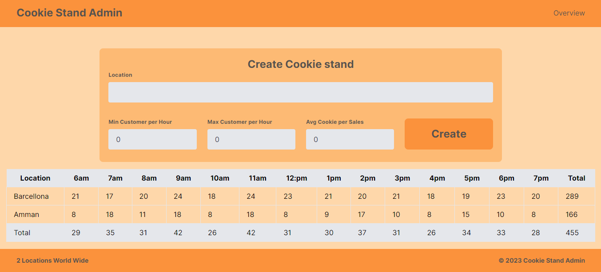

# Cookie Stand Admin

## Lab 37

A simple cookie stand admin app with form to enale the admin to enter the Cookie Stands information.


This is a [Next.js](https://nextjs.org/) project bootstrapped with [`create-next-app`](https://github.com/vercel/next.js/tree/canary/packages/create-next-app).

## Getting Started

First, run the development server:

```bash
npm run dev
# or
yarn dev
# or
pnpm dev
# or
bun dev
```

Open [http://localhost:3000](http://localhost:3000) with your browser to see the result.

You can start editing the page by modifying `app/page.js`. The page auto-updates as you edit the file.

This project uses [`next/font`](https://nextjs.org/docs/basic-features/font-optimization) to automatically optimize and load Inter, a custom Google Font.

## Lab 38

The Cookie Stand Admin App is a web application built using Next.js and styled with Tailwind CSS. It allows users to manage and view cookie stand data, including locations, hourly sales, and totals.

## Outputs





## Features

- **Overview Page:** View an overview of all cookie stands.
- **Create New Stand:** Add a new cookie stand with location and hourly sales data.
- **Report Table:** Display a table with hourly sales data for each cookie stand.
- **Footer:** Show the total number of locations and a copyright notice.

## Installation

To run the app locally, follow these steps:

1. Clone this repository to your local machine:

   ```bash
   git clone <repository-url>
   ```

2. Navigate to the project directory:

   ```bash
   cd cookie-stand-admin
   ```

3. Install dependencies using npm or yarn:

   ```bash
   npm install
   # or
   yarn install
   ```

4. Start the development server:

   ```bash
   npm run dev
   # or
   yarn dev
   ```

5. Open your browser and visit `http://localhost:3000` to use the app.

## Usage

- The homepage displays an overview of all cookie stands.
- Click the "Create New Stand" button to add a new cookie stand with location and hourly sales data.
- The "Report Table" section displays a table with hourly sales data for each cookie stand.
- The "Footer" section shows the total number of locations and a copyright notice.

## Built With

- [Next.js](https://nextjs.org/) - React framework for server-rendered React applications.
- [Tailwind CSS](https://tailwindcss.com/) - Utility-first CSS framework.
- [JavaScript](https://developer.mozilla.org/en-US/docs/Web/JavaScript) - Programming language used for the app's logic.
